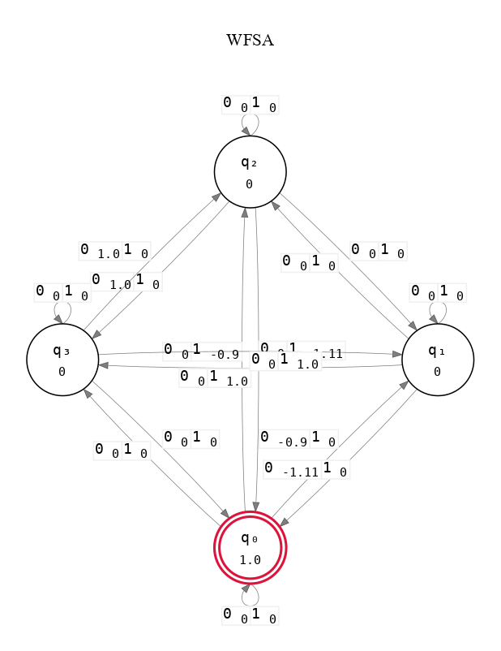
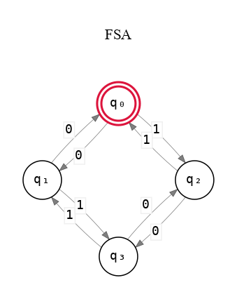

# Hankel

A command-line tool for learning non-deterministic Weighted Finite State Automata with Spectral Learning.

<table align="center" style="border-collapse: collapse; border: 0px solid transparent !important;">
<tr style="border: 0px solid transparent !important;">
<td valign="middle" style="border: 0px solid transparent !important; padding: 10px;"></td>
<td valign="middle" style="border: 0px solid transparent !important; padding: 10px;"></td>
</tr>
</table>

## Installation

```bash
sudo apt install graphviz
```

```bash
python3.10 -m venv venv
source venv/bin/activate
pip install git+https://github.com/JoseLlarena/hankel.git
```
This will install the executables `hankel-learn`, `hankel-predict` and `hankel-show`.

## Usage

```bash
git clone git@github.com:JoseLlarena/hankel.git
cd hankel
```

### Acceptor

```bash
hankel-learn ./examples/data/tomita_2_pos_neg_lab.txt ./tomita_2.npz
hankel-show -o cons,./wfsa.png ./tomita_2.npz
hankel-predict -s -o ./prediction-5-by-2.txt ./examples/data/tomita_5_pos_unlab.txt ./tomita_2.npz
```
### Language model

```bash
hankel-learn -k lm ./examples/data/tomita_2_pos_unlab.txt ./tomita_2_lm.npz
hankel-show -o cons,./lm.png ./tomita_2_lm.npz
hankel-predict -s -o ./prediction-5-by-2-lm.txt ./examples/data/tomita_5_pos_unlab.txt ./tomita_2_lm.npz
```

## Features

- Learning of WFSAs and FSAs
- Learning of acceptors and language models
- Export of models to console, png and pdf
- Choice of basis selection algorithms: frequency-based, length-based, pmi-based and all-affixes
- Example scripts and data for all Tomita grammars and recursive binary boolean languages

## Testing

```bash
python3.10 -m venv venv
source venv/bin/activate
git clone git@github.com:JoseLlarena/hankel.git
cd hankel
pip install -r requirements.txt -r requirements-test.txt
pytest --cov=hankel unittests/*.py --cov-report=term --cov-report=html && python -m webbrowser htmlcov/index.html 
```

## Changelog

Check the [Changelog](https://github.com/JoseLlarena/hankel/blob/main/CHANGELOG.md) for fixes and enhancements of each version.

## License

Copyright Jose Llarena 2025.

Distributed under the terms of the [MIT](https://github.com/JoseLlarena/hankel/blob/main/LICENSE) license, Hankel is free 
and open source software.